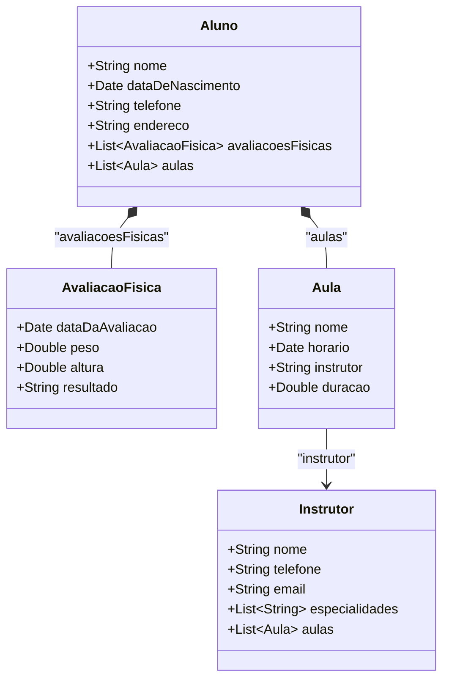
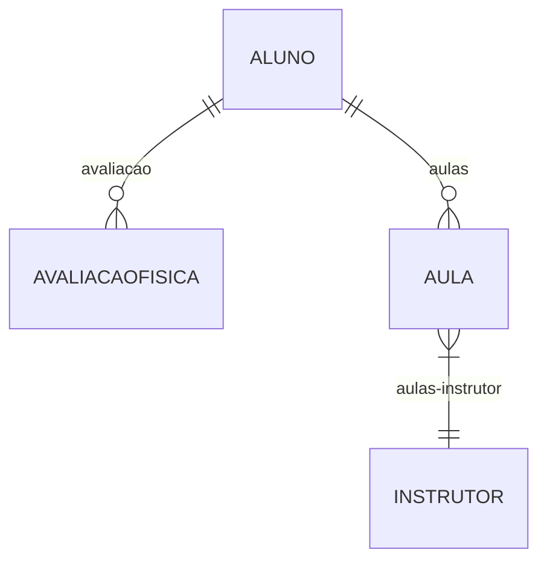

## Academia digital💪

API Restful que implementa o contexto de uma academia e implementa seus principais serviços oferecidos a um aluno de forma digital.

## Principais Tecnologias 🛠️

- **Java 17**
- **PostgreSQL**
- **Spring Boot**
- **Spring DataJPA**
- **OpenAI(Swagger)**
- **Railway**

## Diagrama de classes

## Diagrama ORM

## Layout 🚧

> Em construção. Apenas a versão mobile disponível.

Acesse as UIs do projeto [aqui](https://www.figma.com/design/d7li50nQfNixh8ZALMfPxF/UI---AcademiaDigital?node-id=0-1&t=XlVe1M4QsQKwopeD-1).

## Documentação da API (Swagger)

Acesse a documentação [aqui](https://academiadigital-production.up.railway.app/swagger-ui/index.html).

> [!IMPORTANT]
> O deploy dessa aplicação foi implementado com um banco de dados sem nenhum registro, portando um serviço pode depender do pré-cadastro de outro.

## Atividades futuras ⏳

- [ ] validar campos do usuario (email, telefone, etc.)
- [ ] implementar as UIs utilizando o React JS.
- [ ] integrar back e front-end.
- [ ] Deploy da aplicação completa.
